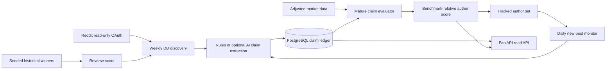

# Architecture and research plan

## Core event flow

The API and scheduler are separate containers so adding API replicas cannot accidentally run a
job more than once. PostgreSQL is shared. The rules extractor makes tests and baseline behavior
deterministic; AI is a replaceable parsing adapter.

## Long-term research methodology

The product should distinguish three questions:

1. **Was the call right?** Fixed, timestamped, benchmark-relative return at 1/3/5 years.
2. **Was the reasoning good?** Separately label valuation, falsifiable assumptions, catalysts,
   risks, and whether later updates honestly revised the thesis.
3. **Is the author reliably skilled?** Estimate only from information available at that date,
   shrink small samples, and report uncertainty beside the score.

Reverse-scouting winners is useful for discovering candidates, but it is not a valid performance
test because it conditions on success. The validation cohort must start from a point-in-time
security universe and include failures and delistings.

## Proposed 1/3/5-year scorecard

Store one outcome row per checkpoint in the next schema revision. Recommended views:

- Absolute total return and SPY-relative total return.
- Sector-relative return to distinguish stock selection from sector beta.
- Maximum drawdown after publication.
- Thesis milestone accuracy (revenue, margins, product launch), scored separately by evidence.
- Hit rate with a credible interval, not just a percentage.
- Number of independent companies and sectors, to expose concentrated repeated bets.

The current MVP uses one declared/default horizon per claim so its schema and score are easy to
audit. It defaults to 365 days.

